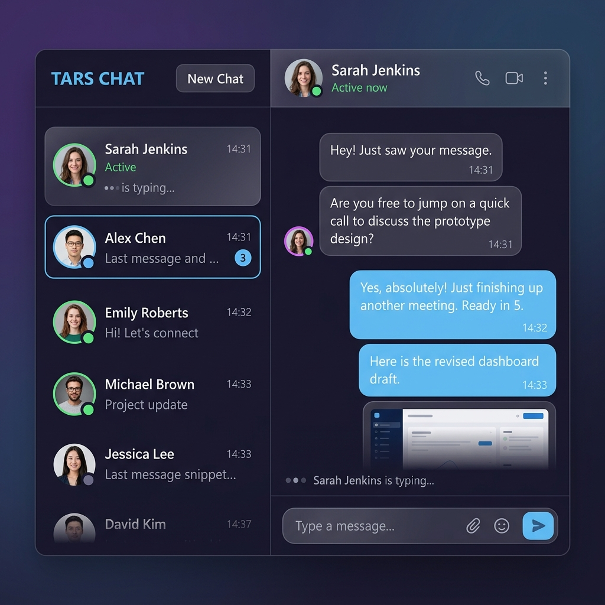

# 💬 Tars Chat App — Real-Time Messaging Platform

[](https://tars-chat-app-hrin.vercel.app/)
[](https://nextjs.org/)
[](https://www.convex.dev/)
[](https://clerk.com/)
[](https://tailwindcss.com/)

A premium, high-fidelity real-time chat application built for the **Tars Full-Stack Developer Internship Challenge**. It supports instantaneous message sync, typing indicators, user presence, and an automatic welcome system that populates mock conversations on first login.

🌐 **Live Deployment**: [https://tars-chat-app-hrin.vercel.app/](https://tars-chat-app-hrin.vercel.app/)

<br/>

<br/>

---

## ✨ Key Features

- ⚡ **Real-Time Syncing**: Powered by Convex subscription hooks. Message threads, typing indicators, and user lists sync immediately across all connected clients.
- 🤖 **Auto-Welcome Seeding**: When a brand new user signs up or logs in for the first time, the client automatically hooks up 5 active chat threads with pre-seeded mock users (`Tars Assistant`, `Alice`, `Bob`, `Charlie`, `Diana`) and delivers custom welcoming messages. The app is populated and ready to test instantly!
- 🔒 **Secure Authentication**: Configured with Clerk Next.js SDK, supporting secure password-based and social OAuth logins.
- 🟢 **Presence Indicators**: Visual green online/gray offline rings around user avatars synced dynamically in the database.
- ✍️ **Typing States**: Visual animated typing indicator dots that trigger in real-time when another participant starts typing in the message box.
- 🔴 **Unread Counters**: Live unread badges on the sidebar next to each active thread, resetting automatically when the thread is clicked.
- 🗑️ **Soft Deletion**: Users can remove sent messages, replacing the bubble contents with a clean *"This message was deleted"* marker.

---

## 🛠️ Tech Stack & Architecture

- **Frontend**: Next.js 15 (App Router, Client & Server Components), Tailwind CSS, Lucide Icons, Date-fns.
- **Backend/Database**: Convex (Real-time schema validation, serverless mutations/queries, reactive subscriptions).
- **Authentication**: Clerk (User sessions, hooks, profile sync).
- **Data Model**:
  - `users`: Stores clerk authentication mappings, image URLs, and activity stats.
  - `conversations`: Holds participant list and last active message reference.
  - `conversationMembers`: Tracks unread counts per user per conversation.
  - `messages`: Records message timestamps, content types, and soft-deletion flags.

---

## 💻 Local Setup & Installation

### 1. Clone & Install
```bash
git clone https://github.com/RaghavParasher/tars-chat-app.git
cd tars-chat-app
npm install
```

### 2. Configure Environment
Create a `.env.local` file in your root directory and paste your API keys:
```env
NEXT_PUBLIC_CONVEX_URL=https://your-project-id.convex.cloud
NEXT_PUBLIC_CLERK_PUBLISHABLE_KEY=pk_test_...
CLERK_SECRET_KEY=sk_test_...
```

### 3. Start Convex Dev Sync
In a separate terminal tab, run the Convex dev client to link your local files to your Convex cloud project:
```bash
npx convex dev
```

### 4. Seed the Database
To populate the 5 mock user accounts into your Convex database, run this seeding script:
```bash
npx convex run seed:seedMockUsers
```

### 5. Launch the App
Run the local Next.js development server:
```bash
npm run dev
```
Open [http://localhost:3000](http://localhost:3000) to see your app running!
